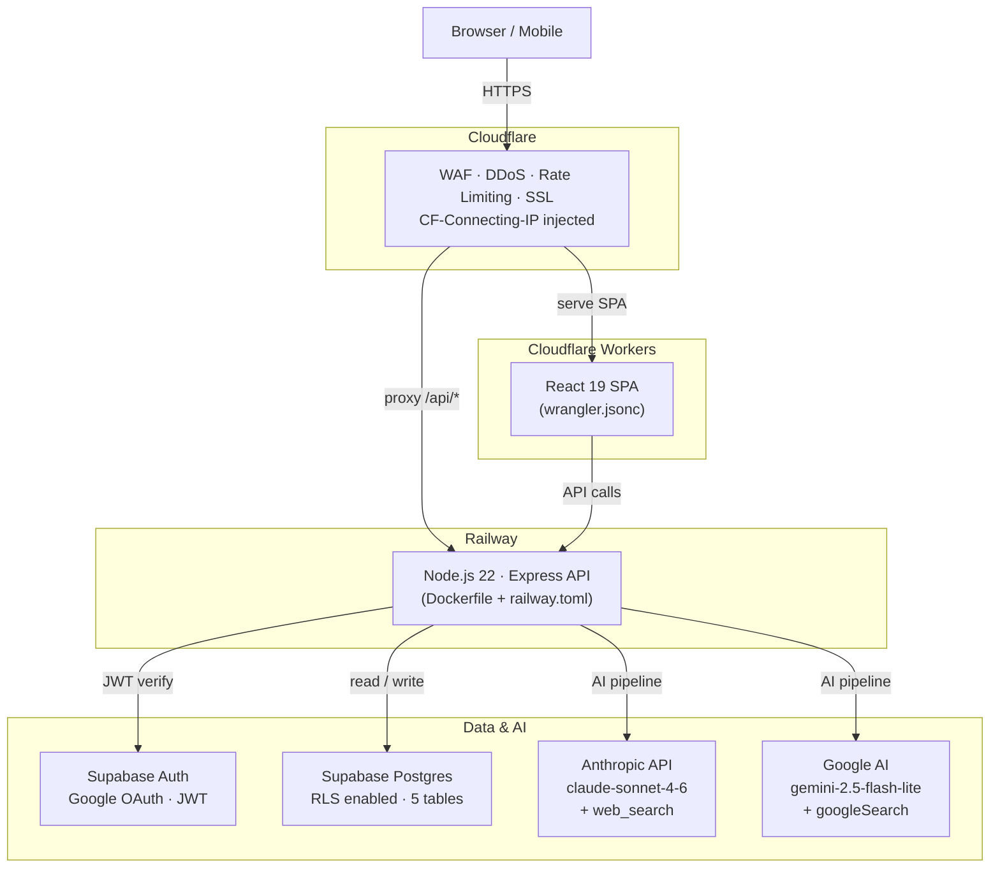

# moat-finder

AI-powered asymmetric investment research engine. Enter a stock ticker, get a structured
research report in 60–90 seconds — powered by Claude Sonnet or Gemini with live web search.

---

## What it does

- **7-step AI pipeline** — Discovery → Deep Dive → Valuation → Risk → Macro → Sentiment → Synthesis
- **Multi-LLM** — choose Claude (Anthropic) or Gemini (Google) per research run; provider stored with each report
- **Scored 1.0–10.0** using a weighted rubric (growth, moat quality, sector momentum, valuation, execution risk)
- **3-scenario napkin math** — Bear / Base / Bull with comparable-matched multiples
- **Constraint & value chain analysis** — classifies primary bottleneck, tests ownership, assesses durability, investability, and rent capture
- **Platform classification** — identifies platform vs single-product companies, maps adjacent-market TAMs
- **Re-rating catalyst** — the single event that could force a 2–3x reprice within 24 months
- **Independent management rating** — grade A–F assessment (CEO track record, capital allocation, recent changes) generated separately from the investment score and never factoring into it
- **Diff-tracked versioning** — every update shows exactly what changed between research runs
- **Role-based auth** — public read / approved write / admin manage
- **Publicly cached** — reports are readable without login; only approved users can trigger new research

---

## Architecture



> The full draw.io diagram is at [`docs/architecture.drawio`](docs/architecture.drawio) —
> open it at [app.diagrams.net](https://app.diagrams.net).

---

## Tech Stack

| Layer              | Technology              | Version               |
| ------------------ | ----------------------- | --------------------- |
| Frontend framework | React                   | 19                    |
| Build tool         | Vite                    | 8                     |
| Styling            | Tailwind CSS            | v4                    |
| Routing            | React Router            | v7                    |
| Server state       | TanStack Query          | v5                    |
| Frontend hosting   | Cloudflare Workers      | —                     |
| Backend runtime    | Node.js                 | v22 LTS               |
| Backend framework  | Express                 | 4                     |
| Backend hosting    | Railway                 | —                     |
| Container          | Docker (node:22-alpine) | multi-stage           |
| Auth               | Supabase Auth           | v2                    |
| Database           | Supabase Postgres       | —                     |
| AI — Claude        | Anthropic SDK           | claude-sonnet-4-6     |
| AI — Gemini        | Google Generative AI    | gemini-2.5-flash-lite |
| Input validation   | Zod                     | —                     |
| Security headers   | Helmet                  | —                     |
| Language           | TypeScript              | strict                |

---

## Features

### Research Report

Each report includes:

1. One-liner thesis
2. Business model diagram (pure React/Tailwind 4-zone canvas)
3. Sector heat check (1–5 flames + hot sector tags)
4. Business model narrative
5. Why Now — upcoming catalysts
6. Moat & competitors
7. Bear case + bull rebuttal + key risks
8. Constraint & value chain analysis (bottleneck type, ownership, durability, rent capture)
9. Macro & policy impact
10. Sentiment & technicals (short interest, 200-day MA, RS vs SPY)
11. Platform optionality map (if platform company)
12. Re-rating catalyst
13. LLM provider badge (Claude or Gemini) shown in report header

**Right sidebar:**

- Napkin math — target price + upside + 3-scenario (Bear/Base/Bull)
- Quarterly results (last 4 quarters)
- Valuation table vs growth-stage-matched peers
- Sector heat
- Management quality rating — independent A–F grade, not factored into investment score

### User Roles

| Role     | Capabilities                                                |
| -------- | ----------------------------------------------------------- |
| Public   | View any cached report, browse ticker grid, version history |
| Pending  | Logged in, awaiting admin approval — same as public         |
| Approved | Everything public + trigger new research + trigger updates  |
| Admin    | Everything approved + approve/reject users + view audit log |

### Versioning & Diff

Every research update creates a new version. A diff modal shows changes before saving:
score deltas, changed sections, added/removed catalysts. The full changelog is visible
at the bottom of every report. Update research automatically re-uses the same LLM provider
that originally generated the report.

---

## Local Development

### Prerequisites

- Node.js v22+
- npm
- Supabase project (or local Supabase CLI)
- Anthropic API key (required)
- Google AI Studio API key (optional — only needed if using Gemini)

### Setup

```bash
# Clone and install
git clone <repo-url>
cd moat-finder

# Backend
cd backend
cp .env.example .env      # fill in your keys
npm install
npm run dev               # http://localhost:3001

# Frontend (new terminal)
cd frontend
cp .env.example .env.local  # fill in your keys
npm install
npm run dev               # http://localhost:5173
```

### Environment Variables

**`backend/.env`**

```
PORT=3001
NODE_ENV=development
SUPABASE_URL=https://<project>.supabase.co
SUPABASE_ANON_KEY=
SUPABASE_SERVICE_ROLE_KEY=
ANTHROPIC_API_KEY=
GEMINI_API_KEY=           # optional — required only if using Gemini provider
DEFAULT_LLM=claude        # claude | gemini (default: claude)
FRONTEND_ORIGIN=http://localhost:5173
```

**`frontend/.env.local`**

```
VITE_SUPABASE_URL=https://<project>.supabase.co
VITE_SUPABASE_ANON_KEY=
VITE_API_BASE_URL=http://localhost:3001
```

### Database

Apply migrations to your Supabase project:

```bash
npx supabase db push
```

Schema source of truth: [`docs/DATABASE.md`](docs/DATABASE.md)

---

## Deployment

### Backend — Railway

1. Create a Railway project and link the repo
2. Set all backend environment variables in Railway dashboard > Variables
3. Railway auto-detects `backend/railway.toml` and builds the Dockerfile on push

```toml
# backend/railway.toml
[build]
builder = "dockerfile"
dockerfilePath = "Dockerfile"

[deploy]
healthcheckPath = "/api/v1/health"
healthcheckTimeout = 120
restartPolicyType = "on_failure"
restartPolicyMaxRetries = 3
```

The backend binds to `0.0.0.0:$PORT` — Railway injects `PORT` at runtime.

### Frontend — Cloudflare Workers

1. Install Wrangler: `npm install -g wrangler`
2. Authenticate: `wrangler login`
3. Set environment variables in Cloudflare dashboard > Workers > Settings > Variables
4. Deploy:

```bash
cd frontend
npm run build
npm run deploy      # runs: wrangler deploy
```

SPA routing is handled by `not_found_handling: "single-page-application"` in `wrangler.jsonc` —
all 404s return `index.html` so React Router handles client-side navigation.

### Cloudflare (WAF / DNS)

1. Add your domain to Cloudflare with the DNS record proxied (orange cloud ON)
2. Point the A/CNAME to your Cloudflare Workers subdomain
3. Configure firewall rules:
   - Geo-block: `ip.geoip.country != "AU"` → Block (adjust for your region)
   - Rate limit: 60 req/min per IP on `/api/v1/research/*`
4. Enable Bot Fight Mode
5. SSL: Full (strict) mode

### CI/CD (GitHub Actions)

The `.github/workflows/deploy.yml` workflow automatically deploys:

- `frontend/` changes → Cloudflare Workers via `wrangler deploy`
- `backend/` changes → Railway via Railway CLI or webhook

---

## Development Commands

```bash
# Backend (from backend/)
npm run dev          # tsx watch — hot reload on port 3001
npm run build        # tsc compile to dist/
npm run typecheck    # tsc --noEmit
npm run test         # vitest run
npm run lint         # eslint src/**/*.ts

# Frontend (from frontend/)
npm run dev          # Vite dev server — port 5173
npm run build        # Vite production build
npm run preview      # preview production build locally
npm run typecheck    # tsc --noEmit
npm run lint         # ESLint
npm run deploy       # wrangler deploy (production)
```

---

## Project Structure

```
moat-finder/
├── README.md
├── docs/
│   ├── ARCHITECTURE.md       # Detailed system design
│   ├── DATABASE.md           # Schema + RLS policies (source of truth)
│   ├── FEATURES.md           # Product requirements
│   └── architecture.drawio   # Architecture diagram (open at app.diagrams.net)
├── backend/
│   ├── Dockerfile
│   ├── railway.toml
│   └── src/
│       ├── routes/           # research.ts, admin.ts, health.ts
│       ├── services/         # pipeline.ts, llm.ts, diff.ts, supabase.ts
│       ├── middleware/        # auth.ts, requireRole.ts, audit.ts
│       ├── types/            # report.types.ts, database.types.ts
│       └── utils/            # ip.ts, ticker.ts
└── frontend/
    ├── wrangler.jsonc
    └── src/
        ├── pages/            # Home, Report, Versions, Admin
        ├── components/       # layout/, report/, research/, ui/
        ├── hooks/            # useAuth, useResearch, usePipeline
        ├── lib/              # supabase.ts, api.ts, validation.ts
        └── types/            # report.types.ts
```

---

## AI Pipeline — How It Works

```
Ticker input + provider selection (Claude or Gemini)
     │
     ▼
Step 1 — Discovery (sequential)
     Identifies: company, industry, competitors, platform type,
     adjacent-market TAMs, re-rating catalyst
     │
     ▼
Steps 2–6 — run concurrently via Promise.all
     ├── Step 2: Deep Dive (moat, business model, catalysts, constraint analysis)
     ├── Step 3: Valuation & Financials (3-scenario napkin math)
     ├── Step 4: Risk Red Team (bear case, SEC risks, rebuttal)
     ├── Step 5: Macro & Sector (policy, tariffs, sector heat)
     └── Step 6: Sentiment & Technicals (short interest, 200-day MA)
     │
     ▼
Step 7 — Synthesis
     Scores 1.0–10.0, writes final report JSON + llm_provider, saves to Supabase
     │
     ▼
Report saved → SSE completion event → frontend redirects to report
```

All pipeline steps route through `backend/src/services/llm.ts` — the LLM abstraction layer.
Add a new provider by implementing a call function there; `pipeline.ts` stays provider-agnostic.

**Smart update pipeline** (`runUpdatePipeline`): skips Steps 2 and 4, reusing moat and risk data
from the existing report. Only Steps 1, 3, 5, 6, and 7 run — reducing API cost on routine updates.

---

## Changelog

### v0.6.0

- **Management rating backfill**: update pipeline detects reports missing `management_rating` and forces a fresh Step 2 re-run to generate one. New research pipeline also invalidates any stale Step 2 checkpoint missing the field.
- **Enriched list API**: `GET /api/v1/research` now returns `upside_percent`, `target_price`, `hot_sector_match`, `sector_heat`, `thesis`, `company_name`, and `sector` — no extra API calls needed on the frontend.
- **Napkin math on home cards**: target price (gold) and upside (green/red) shown on every stock card. First hot-sector match tag shown as a muted pill.
- **Filter & sort bar**: above the researched-tickers grid — filter by Score ≥, Upside ≥, Sector (substring), and sort by date/score/upside. Client-side only, instant. "Showing X of Y stocks" count.

### v0.5.2

- **Management Rating**: independent A–F management quality assessment generated in Step 2 (Deep Dive). Covers CEO track record, recent leadership changes, and capital allocation. Injected into the report after Step 7 synthesis — the scoring LLM never sees it, so it cannot influence the 1–10 investment score. New `ManagementRating.tsx` sidebar card with subtitle "Independent assessment — not included in investment score". Field `report_json.management_rating` is optional; absent in pre-v0.5.2 reports.

### v0.5.1

- **BusinessDiagram RiskZone readability**: KEY RISKS zone had red text on a red-tinted background. Fixed to `border-l-4 border-red-500` left accent with dark navy surface, `text-white` titles, `text-slate-300` body text.

### v0.5.0

- **Stripe design system**: full frontend restyle. Navy palette remapped to purple-tinted indigo. Purple (`#533afd`) replaces green/gold for all UI chrome. Gold (`#d4a853`) reserved for financial data. Stripe blue-tinted shadow on hero sections. Hero sections use `bg-gradient-to-br from-navy-800 via-[#1f2170] to-navy-950`.
- **Font replacement**: proprietary Söhne replaced with Plus Jakarta Sans (Google Fonts). Playfair Display and Inter removed. Global `font-weight: 300` default with heading overrides. JetBrains Mono kept for financial data.
- **BearCase readability**: Key Risks section fixed from red-on-red to left-border-only accent with readable dark surface.
- **NapkinMath layout**: Target Price and Upside now stack vertically (`flex-col gap-2`) instead of side-by-side, eliminating overflow at all viewport widths.

### v0.3.0

- **Multi-LLM support**: new `llm.ts` abstraction layer routes research to Claude (`claude-sonnet-4-6` + `web_search` tool) or Gemini (`gemini-2.5-flash-lite` + `googleSearch` grounding), selectable per run
- **LLM selector**: provider dropdown (Claude / Gemini) in the research confirm modal; defaults to Claude
- **LLM badge**: small `✦ Claude` or `◆ Gemini` badge shown in the report header
- **Provider persistence**: `report_json.llm_provider` and `report_json.llm_model` recorded for every report; update research automatically re-uses the same provider
- **New env vars**: `GEMINI_API_KEY` (optional, Railway) and `DEFAULT_LLM=claude` (optional)

### v0.2.2

- **Trust proxy**: `app.set('trust proxy', 1)` added as the first line after `express()` — fixes `express-rate-limit` `ValidationError` behind Cloudflare + Railway proxy layers that was crashing SSE connections before reports could save
- **Step 7 JSON hardening**: strengthened system prompt to forbid prose responses; added `extractJSON()` with fence-stripping and outermost `{…}` search; try/catch deletes only the Step 7 checkpoint on parse failure so Steps 1–6 survive for the next retry
- **Score field**: Step 7 now explicitly outputs `score` (1.0–10.0) in the JSON schema; `report.score` correctly used instead of `sector_heat` for the Supabase `score` column
- **Save reliability**: `tickerData` null guard tightened; explicit `console.error` on every Supabase write failure; verification read-back after PUT version insert; `(existingReport.version ?? 1) + 1` guards missing version field

### v0.2.1

- **Constraint & value chain analysis**: Step 2 (Deep Dive) now performs a full 8-point bottleneck analysis — classifies the primary constraint (supply chain / technology / regulatory / capital / none), tests whether the company OWNS the constraint (not just adjacent to it), assesses durability, value chain position, rent capture, investability, who can relieve it, and the investable window before consensus prices it in
- **Scoring update**: Step 7 applies a +0.5 constraint premium when `investable=true`, `controls_constraint=true`, and `durability=durable`; applies a constraint penalty if the company is adjacent to a bottleneck but does not capture the rent
- **Bug fix — update pipeline token waste**: `runUpdatePipeline` was incorrectly running Steps 2 and 4 via an empty cache map, causing unnecessary Claude API calls and false `error` SSE events that made the frontend show a failure state. Fixed by calling only Steps 3, 5, 6 directly

### v0.2.0

- **Hosting migration**: Vercel → Cloudflare Workers (frontend), Render → Railway (backend)
- **Backend containerised**: Docker multi-stage build on `node:22-alpine`
- **Frontend updated**: React 18 → 19, Tailwind v3 → v4, React Router v6 → v7, Vite v8
- **Pipeline v2**: platform classification, 3-scenario napkin math, bear case rebuttal,
  comp selection rules, platform premium scoring, temp-overhang scoring protection
- **CI/CD**: GitHub Actions workflow for automated deploys
- **Security**: Content Security Policy hardening for Cloudflare Workers headers
- **Tailwind v4**: migrated to `@import "tailwindcss"` + `@theme {}` syntax

### v0.1.0

- Initial release: React + Express + Supabase + Anthropic 7-step pipeline
- Vercel (frontend) + Render (backend) hosting
- Role-based auth, diff-tracked versioning, SSE streaming progress

---

## Security Notes

- All API keys are server-side only — never in the frontend bundle
- CORS restricted to the Cloudflare Workers origin
- Supabase RLS enforced at the database level as the final safety net
- `CF-Connecting-IP` used for all IP logging — never `req.ip`
- Helmet.js sets security headers on every response
- `.claudeignore` prevents Claude Code from reading `.env` files
