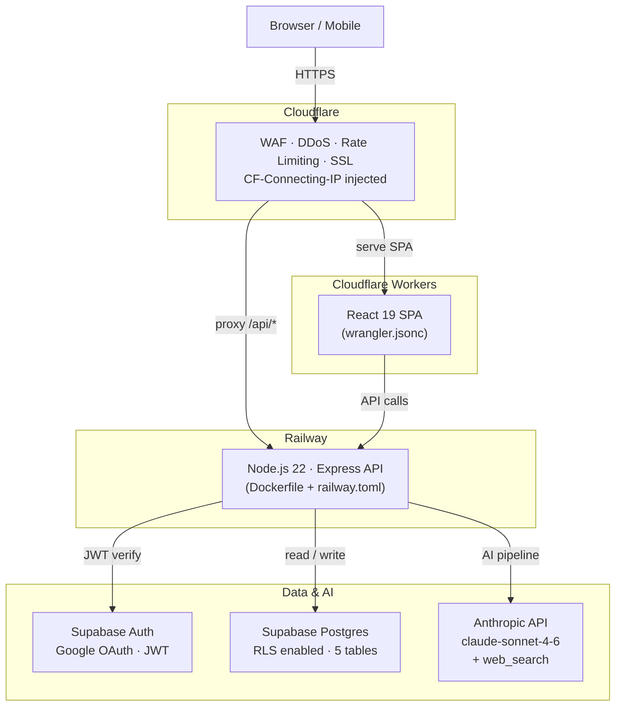

# moat-finder

AI-powered asymmetric investment research engine. Enter a stock ticker, get a structured
research report in 60–90 seconds — powered by Claude Sonnet with live web search.

---

## What it does

- **7-step AI pipeline** — Discovery → Deep Dive → Valuation → Risk → Macro → Sentiment → Synthesis
- **Scored 1.0–10.0** using a weighted rubric (growth, moat quality, sector momentum, valuation, execution risk)
- **3-scenario napkin math** — Bear / Base / Bull with comparable-matched multiples
- **Platform classification** — identifies platform vs single-product companies, maps adjacent-market TAMs
- **Re-rating catalyst** — the single event that could force a 2–3x reprice within 24 months
- **Diff-tracked versioning** — every update shows exactly what changed between research runs
- **Role-based auth** — public read / approved write / admin manage
- **Publicly cached** — reports are readable without login; only approved users can trigger new research

---

## Architecture



> The full draw.io diagram is at [`docs/architecture.drawio`](docs/architecture.drawio) —
> open it at [app.diagrams.net](https://app.diagrams.net).

---

## Tech Stack

| Layer              | Technology              | Version           |
| ------------------ | ----------------------- | ----------------- |
| Frontend framework | React                   | 19                |
| Build tool         | Vite                    | 8                 |
| Styling            | Tailwind CSS            | v4                |
| Routing            | React Router            | v7                |
| Server state       | TanStack Query          | v5                |
| Frontend hosting   | Cloudflare Workers      | —                 |
| Backend runtime    | Node.js                 | v22 LTS           |
| Backend framework  | Express                 | 4                 |
| Backend hosting    | Railway                 | —                 |
| Container          | Docker (node:22-alpine) | multi-stage       |
| Auth               | Supabase Auth           | v2                |
| Database           | Supabase Postgres       | —                 |
| AI                 | Anthropic SDK           | claude-sonnet-4-6 |
| Input validation   | Zod                     | —                 |
| Security headers   | Helmet                  | —                 |
| Language           | TypeScript              | strict            |

---

## Features

### Research Report

Each report includes:

1. One-liner thesis
2. Business model diagram (pure React/Tailwind 4-zone canvas)
3. Sector heat check (1–5 flames + hot sector tags)
4. Business model narrative
5. Why Now — upcoming catalysts
6. Valuation table vs growth-stage-matched peers
7. 3-scenario napkin math (Bear / Base / Bull)
8. Moat & competitors
9. Bear case + bull rebuttal
10. Macro & policy impact
11. Sentiment & technicals (short interest, 200-day MA, RS vs SPY)
12. Platform optionality map (if platform company)
13. Re-rating catalyst

### User Roles

| Role     | Capabilities                                                |
| -------- | ----------------------------------------------------------- |
| Public   | View any cached report, browse ticker grid, version history |
| Pending  | Logged in, awaiting admin approval — same as public         |
| Approved | Everything public + trigger new research + trigger updates  |
| Admin    | Everything approved + approve/reject users + view audit log |

### Versioning & Diff

Every research update creates a new version. A diff modal shows changes before saving:
score deltas, changed sections, added/removed catalysts. The full changelog is visible
at the bottom of every report.

---

## Local Development

### Prerequisites

- Node.js v22+
- npm
- Supabase project (or local Supabase CLI)
- Anthropic API key

### Setup

```bash
# Clone and install
git clone <repo-url>
cd moat-finder

# Backend
cd backend
cp .env.example .env      # fill in your keys
npm install
npm run dev               # http://localhost:3001

# Frontend (new terminal)
cd frontend
cp .env.example .env.local  # fill in your keys
npm install
npm run dev               # http://localhost:5173
```

### Environment Variables

**`backend/.env`**

```
PORT=3001
NODE_ENV=development
SUPABASE_URL=https://<project>.supabase.co
SUPABASE_ANON_KEY=
SUPABASE_SERVICE_ROLE_KEY=
ANTHROPIC_API_KEY=
FRONTEND_ORIGIN=http://localhost:5173
```

**`frontend/.env.local`**

```
VITE_SUPABASE_URL=https://<project>.supabase.co
VITE_SUPABASE_ANON_KEY=
VITE_API_BASE_URL=http://localhost:3001
```

### Database

Apply migrations to your Supabase project:

```bash
npx supabase db push
```

Schema source of truth: [`docs/DATABASE.md`](docs/DATABASE.md)

---

## Deployment

### Backend — Railway

1. Create a Railway project and link the repo
2. Set all backend environment variables in Railway dashboard > Variables
3. Railway auto-detects `backend/railway.toml` and builds the Dockerfile on push

```toml
# backend/railway.toml
[build]
builder = "dockerfile"
dockerfilePath = "Dockerfile"

[deploy]
healthcheckPath = "/api/v1/health"
healthcheckTimeout = 120
restartPolicyType = "on_failure"
restartPolicyMaxRetries = 3
```

The backend binds to `0.0.0.0:$PORT` — Railway injects `PORT` at runtime.

### Frontend — Cloudflare Workers

1. Install Wrangler: `npm install -g wrangler`
2. Authenticate: `wrangler login`
3. Set environment variables in Cloudflare dashboard > Workers > Settings > Variables
4. Deploy:

```bash
cd frontend
npm run build
npm run deploy      # runs: wrangler deploy
```

SPA routing is handled by `not_found_handling: "single-page-application"` in `wrangler.jsonc` —
all 404s return `index.html` so React Router handles client-side navigation.

### Cloudflare (WAF / DNS)

1. Add your domain to Cloudflare with the DNS record proxied (orange cloud ON)
2. Point the A/CNAME to your Cloudflare Workers subdomain
3. Configure firewall rules:
   - Geo-block: `ip.geoip.country != "AU"` → Block (adjust for your region)
   - Rate limit: 60 req/min per IP on `/api/v1/research/*`
4. Enable Bot Fight Mode
5. SSL: Full (strict) mode

### CI/CD (GitHub Actions)

The `.github/workflows/deploy.yml` workflow automatically deploys:

- `frontend/` changes → Cloudflare Workers via `wrangler deploy`
- `backend/` changes → Railway via Railway CLI or webhook

---

## Development Commands

```bash
# Backend (from backend/)
npm run dev          # tsx watch — hot reload on port 3001
npm run build        # tsc compile to dist/
npm run typecheck    # tsc --noEmit
npm run test         # vitest run
npm run lint         # eslint src/**/*.ts

# Frontend (from frontend/)
npm run dev          # Vite dev server — port 5173
npm run build        # Vite production build
npm run preview      # preview production build locally
npm run typecheck    # tsc --noEmit
npm run lint         # ESLint
npm run deploy       # wrangler deploy (production)
```

---

## Project Structure

```
moat-finder/
├── README.md
├── docs/
│   ├── ARCHITECTURE.md       # Detailed system design
│   ├── DATABASE.md           # Schema + RLS policies (source of truth)
│   ├── FEATURES.md           # Product requirements
│   └── architecture.drawio   # Architecture diagram (open at app.diagrams.net)
├── backend/
│   ├── Dockerfile
│   ├── railway.toml
│   └── src/
│       ├── routes/           # research.ts, admin.ts, health.ts
│       ├── services/         # pipeline.ts, diff.ts, supabase.ts
│       ├── middleware/        # auth.ts, requireRole.ts, audit.ts
│       ├── types/            # report.types.ts, database.types.ts
│       └── utils/            # ip.ts, ticker.ts
└── frontend/
    ├── wrangler.jsonc
    └── src/
        ├── pages/            # Home, Report, Versions, Admin
        ├── components/       # layout/, report/, research/, ui/
        ├── hooks/            # useAuth, useResearch, usePipeline
        ├── lib/              # supabase.ts, api.ts, validation.ts
        └── types/            # report.types.ts
```

---

## AI Pipeline — How It Works

```
Ticker input
     │
     ▼
Step 1 — Discovery (sequential)
     Identifies: company, industry, competitors, platform type,
     adjacent-market TAMs, re-rating catalyst
     │
     ▼
Steps 2–6 — run concurrently via Promise.allSettled
     ├── Step 2: Deep Dive (moat, business model, catalysts)
     ├── Step 3: Valuation & Financials (3-scenario napkin math)
     ├── Step 4: Risk Red Team (bear case, SEC risks, rebuttal)
     ├── Step 5: Macro & Sector (policy, tariffs, sector heat)
     └── Step 6: Sentiment & Technicals (short interest, 200-day MA)
     │
     ▼
Step 7 — Synthesis
     Scores 1.0–10.0, writes final report JSON, saves to Supabase
     │
     ▼
Report saved → SSE completion event → frontend redirects to report
```

Prompt caching is used across Steps 2–6: Step 1 output is sent as an
`ephemeral` cached content block, reducing input tokens by ~60–70%.

---

## Changelog

### v0.2.0

- **Hosting migration**: Vercel → Cloudflare Workers (frontend), Render → Railway (backend)
- **Backend containerised**: Docker multi-stage build on `node:22-alpine`
- **Frontend updated**: React 18 → 19, Tailwind v3 → v4, React Router v6 → v7, Vite v8
- **Pipeline v2**: platform classification, 3-scenario napkin math, bear case rebuttal,
  comp selection rules, platform premium scoring, temp-overhang scoring protection
- **CI/CD**: GitHub Actions workflow for automated deploys
- **Security**: Content Security Policy hardening for Cloudflare Workers headers
- **Tailwind v4**: migrated to `@import "tailwindcss"` + `@theme {}` syntax

### v0.1.0

- Initial release: React + Express + Supabase + Anthropic 7-step pipeline
- Vercel (frontend) + Render (backend) hosting
- Role-based auth, diff-tracked versioning, SSE streaming progress

---

## Security Notes

- All API keys are server-side only — never in the frontend bundle
- CORS restricted to the Cloudflare Workers origin
- Supabase RLS enforced at the database level as the final safety net
- `CF-Connecting-IP` used for all IP logging — never `req.ip`
- Helmet.js sets security headers on every response
- `.claudeignore` prevents Claude Code from reading `.env` files
